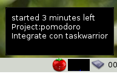

Don't make any excuse anymore to not use the [Pomodoro Technique](https://en.wikipedia.org/wiki/Pomodoro_Technique)!

###Info

Boilerplate implementation of the pomodoro technique in bash script.

It works with a client/server architecture.

Minimalistic implementation with FSM (Finite State Machine), some mutex (flock) and some bash powa.

The typical workflow is start the daemon once log in (systemd,openbox autostart ...) and 
then control it with the simple trayicon app (not a must so client included)

A small hack project.

###Dependencies

1. flock
2. inotify-tools 
3. yad 
4. taskwarrior (or any task management). **OPTIONAL**

Great tools all indeed!

###Why yet another pomodoro app?

Emmm...for fun? :o:

Just serious, there isn't anything alike for linux AFAIK.

###Screenshots

Relax time:

Back to work:

Trayicon:

###TODO

- [x] Make the gtk trayicon app (yad rulez)
- [x] Only one daemon instance
- [x] Taskwarrior integration 
- [ ] Unit testing (bats)

###FIXED

1. Fix/report weird bug with combo-box values when changed from child form
